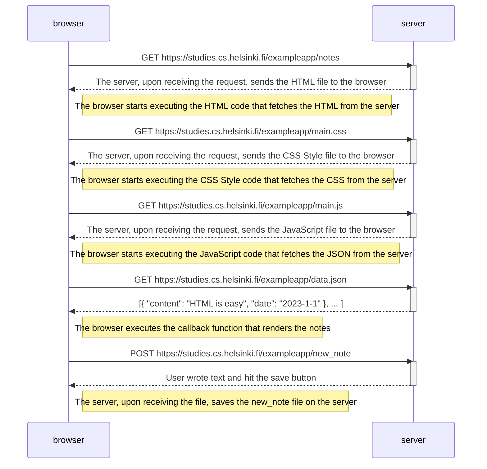

```mermaid
    sequenceDiagram
    participant browser
    participant server

    browser->>server: GET https://studies.cs.helsinki.fi/exampleapp/notes
    activate server
    server-->>browser: The server, upon receiving the request, sends the HTML file to the browser
    deactivate server

    Note right of browser: The browser starts executing the HTML code that fetches the HTML from the server

    browser->>server: GET https://studies.cs.helsinki.fi/exampleapp/main.css
    activate server
    server-->>browser: The server, upon receiving the request, sends the CSS Style file to the browser
    deactivate server

    Note right of browser: The browser starts executing the CSS Style code that fetches the CSS from the server

    browser->>server: GET https://studies.cs.helsinki.fi/exampleapp/main.js
    activate server
    server-->>browser: The server, upon receiving the request, sends the JavaScript file to the browser
    deactivate server

    Note right of browser: The browser starts executing the JavaScript code that fetches the JSON from the server

    browser->>server: GET https://studies.cs.helsinki.fi/exampleapp/data.json
    activate server
    server-->>browser: [{ "content": "HTML is easy", "date": "2023-1-1" }, ... ]
    deactivate server
    
    Note right of browser: The browser executes the callback function that renders the notes

    

    browser->>server: POST https://studies.cs.helsinki.fi/exampleapp/new_note
    activate server
    server-->>browser:User wrote text and hit the save button
    deactivate server

    Note right of browser: The server, upon receiving the file, saves the new_note file on the server
    

```